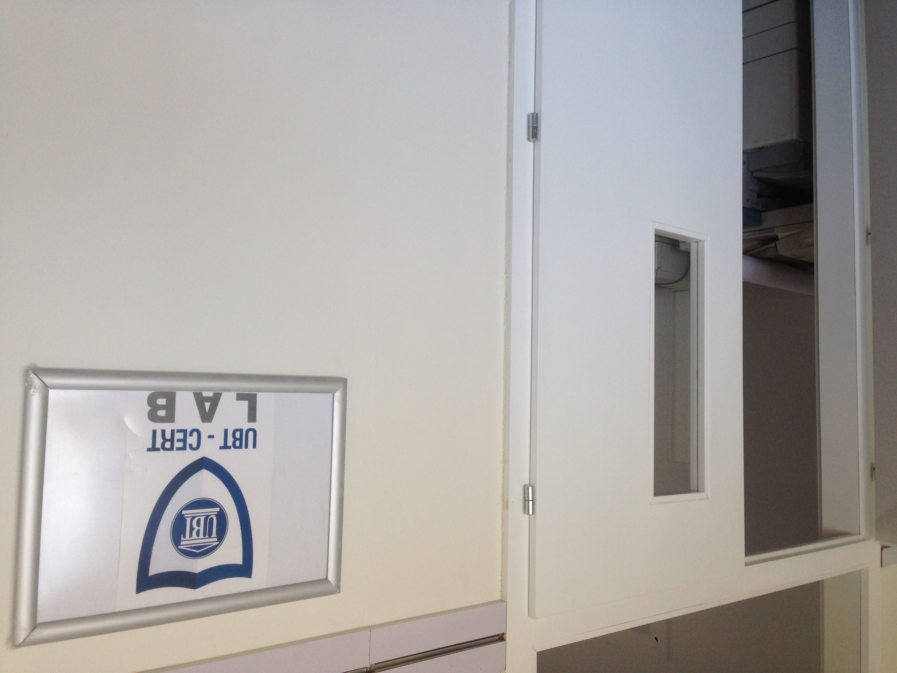
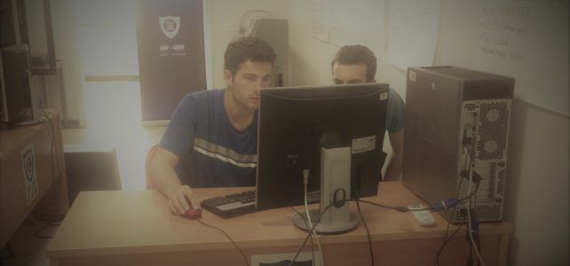

# Establishing and Leading UBT-CERT

### Academic CERT Leadership Case Study | Dr. Atdhe Buja | 2016–2018

I founded and led UBT-CERT at the University for Business and Technology in Kosovo, developing its cybersecurity strategy, governance documentation, laboratory capability, and student internship program.

My work included policy drafting and implementation, organizational risk assessment, and coordination of the preparation process supporting FIRST membership and Trusted Introducer recognition.

Key milestones during my tenure included:

* Trusted Introducer listing in August 2016.
* A CERT laboratory operating from March 2017.
* FIRST membership beginning in November 2017.
* Trusted Introducer accreditation in August 2018.

This personal case study describes my contribution alongside the work of colleagues, institutional leadership, and external partners.

## Project at a glance
| Area | Summary |
| --- | --- |
| Role | CERT Manager; founder and establishment lead, as described in my personal account |
| Team | Three-person CERT team, including the manager |
| Incident tracking | RTIR for incident tracking, report correlation, and stakeholder communication |
| Context | Academic CERT serving a university community |
| Membership preparation | Ten-month effort, December 2016-September 2017, covering policy drafting/implementation and 29 prerequisites, documented in a historical report excerpt |
| FIRST milestone | Team membership since November 2017, supported by the supplied 2018 certificate |
| Trusted Introducer milestones | Listed 30 August 2016; accredited 1 August 2018, according to the public directory |
| Student development | Four-month internship plan, March-June 2017; CERT laboratory and practical security exercises |

## My contribution
- Led cybersecurity strategy development and the establishment of the academic CERT team and laboratory.
- Coordinated policy drafting and implementation and preparation of evidence for FIRST membership.
- Led the membership preparation process, including coordination around sponsorship and assessment.
- Conducted organizational risk analysis, developed a risk register and planned risk treatment.
- Prepared CTF scenarios and supported the laboratory infrastructure and network security configuration.
- Designed student internship activities combining technical exercises, research, security reporting and policy drafting.

## Governance and Policy Development

I drafted and implemented governance documents, security policies, and operational procedures supporting UBT-CERT’s preparation for Trusted Introducer recognition and FIRST membership.

The work covered information classification and protection, secure communication, incident reporting and response, organizational structure, physical and network security, inter-team cooperation, and professional development.

The recovered inventory documents six TI-related entries and 22 FIRST-related entries, including subjects shared across both preparation processes.

[View the governance, policy, and procedure inventory](docs/policy-development.md).

## Selected Policy Sample

A sanitized historical excerpt illustrates my work on information
classification, individual access accountability, third-party
confidentiality, and differentiated protection levels.

[Read the information classification and protection excerpt](docs/information-classification-excerpt.md).

The sample is a clearly labeled editorial adaptation of retained
historical documents.

## Why this work matters
The project connects governance with practical capability: defining a team's purpose, establishing a laboratory, developing policies, coordinating external recognition and creating a learning environment for students. The resulting portfolio demonstrates security program development, stakeholder coordination, documentation and technical education.

## Laboratory and Student Activities

The photographs below document the UBT-CERT laboratory and student
internship activities from my tenure as founder and CERT Manager.

*Entrance to the UBT-CERT laboratory.*

*Student collaboration during the internship program I designed and supervised.*

Further details: [laboratory development](docs/case-study.md) and
[student internship program](docs/internship-program.md).

## Explore the case study
- [Project narrative](docs/case-study.md)
- [Timeline and membership terminology](docs/timeline.md)
- [Student internship program](docs/internship-program.md)

## Public verification
[Trusted Introducer team directory](https://tf-csirt.org/trusted-introducer/directory/teams/ubt-cert/)

The Trusted Introducer directory records UBT-CERT’s establishment and recognition milestones. The narrative in this repository summarizes my historical work using retained project documentation, presentations, and the policy inventory. These pages were prepared retrospectively in 2026 and do not represent the team’s current operational procedures.

## Professional links
[GitHub](https://github.com/atdhebuja) | [Website](https://atdheb.com) | [LinkedIn](https://linkedin.com/in/atdhebuja)
