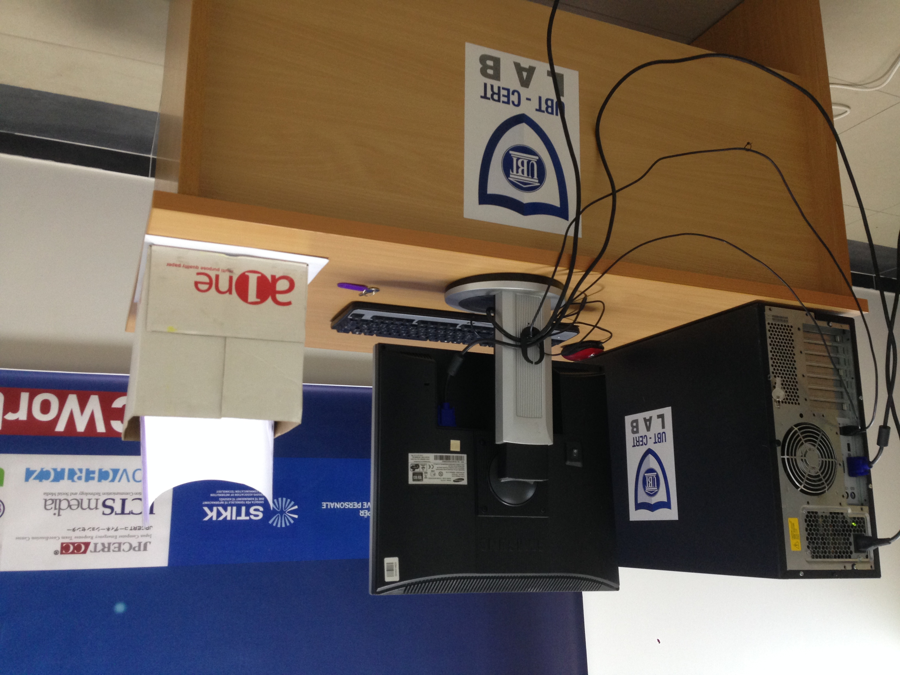

# Case study: building an academic CERT capability

## Context and purpose
UBT-CERT was established within a university setting. The May 2017 introduction presentation describes education, research, trusted information sharing, baseline security requirements, incident reporting and development of student practical skills as parts of its mission and objectives.

## My role
As CERT Manager, I led work spanning strategy, team and laboratory establishment, membership preparation, organizational risk analysis and student training. This account describes my leadership contribution while recognizing that organizational approval, partner support and team delivery were also necessary.

As founder and CERT Manager, I led a three-person CERT team, with
responsibility for management, coordination, and communication.
The team combined technical responsibilities across systems,
web technologies, penetration testing, training, and forensics.

My work covered cybersecurity strategy, team and laboratory
establishment, international membership preparation, organizational
risk analysis, and student training. Delivery involved collaboration
with institutional leadership, colleagues, and external partners.

## Workstreams
### Strategy and governance
I led development of the cybersecurity strategy supporting creation of the CERT. The work included defining direction, drafting and implementing policies, identifying organizational risks, building a risk register and planning mitigation. My historical role description refers to ISO 27001 and ITIL alignment; this is not a claim that the organization held ISO certification or underwent a conformity assessment.

### FIRST membership preparation
A historical Albanian report excerpt records a ten-month period from December 2016 through September 2017 devoted to compiling, drafting and implementing policies and addressing 29 membership prerequisites. It also describes sponsor coordination, an assessment visit and the subsequent membership outcome in November 2017.

The 29-item count is a historical project figure. It does not mean 29 separate policies, and this portfolio does not reproduce or claim to define FIRST's current requirements.

### Incident tracking and coordination

UBT-CERT used Request Tracker for Incident Response (RTIR) to
support incident tracking and coordination. The historical
operational documentation describes correlating incident reports,
identifying related reports, and managing communication with
reporters, collaborating security teams, and internal stakeholders.

Access to the tracking system was restricted to the CERT team.
My role covered team management, coordination, and communication.

### CERT laboratory and exercises
My role description records three phases: preparation of the environment; placement of devices and requirements/acceptance work; and network device configuration, security measures and adaptation of Hacking Lab infrastructure. The May 2017 presentation states that the laboratory had been operating since March 2017. I also prepared CTF scenarios and supporting infrastructure.

## Laboratory Photographs

I led the establishment of the CERT laboratory, including environment
preparation, equipment coordination, network configuration, and security
measures. These photographs document the physical setting associated
with that work.

*Laboratory entrance and UBT-CERT signage.*

*Workstation and equipment within the CERT laboratory.*

### Student development
I designed the March–June 2017 internship program and supervised student learning activities in the CERT laboratory. The curriculum covered network and web security assessment, traffic analysis, malware-analysis topics, attack and defense exercises, security reporting, and policy development. The internship page summarizes the planned curriculum; it does not claim that every listed exercise was completed.

## Outcomes supported by the available evidence
- FIRST membership from November 2017, with good standing for 2018 confirmed by the supplied certificate.
- Trusted Introducer listing and subsequent accreditation recorded in its public directory.
- A CERT laboratory documented as operating in March 2017.
- A structured four-month internship plan attributed to Atdhe Buja as CERT Manager.

## Scope
This case study focuses on establishing the CERT, developing its governance and operating documentation, preparing for international membership, and supporting student practical learning. It summarizes historical work rather than current UBT-CERT operations.

See the [timeline](timeline.md).
