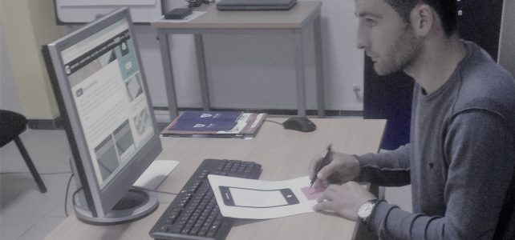

# UBT-CERT Student Internship Program

**Program period:** March–June 2017
**Program designer and supervisor:** Atdhe Buja, UBT-CERT Manager
**Setting:** UBT-CERT, University for Business and Technology, Kosovo

## Overview

As part of developing UBT-CERT’s academic and practical cybersecurity capabilities, I designed a four-month internship program and supervised student learning activities in the CERT laboratory.

The program connected technical security exercises with research, reporting, teamwork, and policy development. It provided a structured setting for students to explore cybersecurity problems and develop recommendations.

This page summarizes the historical internship plan. It describes the planned curriculum rather than asserting that every listed exercise was completed.

## My Contribution

* Designed the internship curriculum and planned practical activities.
* Supervised student learning within the CERT laboratory.
* Connected network, system, and application security topics with attack and defense exercises.
* Included security reporting, research, and policy drafting alongside technical work.
* Planned opportunities for participation in cybersecurity events and collaborative activities.

## Curriculum

| Area                              | Planned Topics and Activities                                                                                         |
| --------------------------------- | --------------------------------------------------------------------------------------------------------------------- |
| Network reconnaissance            | Footprinting, network discovery, DNS queries, route tracing, and collection of publicly available information.        |
| Network assessment                | Asset discovery, port scanning, service enumeration, vulnerability scanning, and network troubleshooting.             |
| Host and system security          | System monitoring, credential security concepts, file analysis, and examination of host security weaknesses.          |
| Network traffic analysis          | Packet inspection, network topology analysis, and examination of interception and spoofing techniques.                |
| Web security                      | Web server and application assessment, including black-box, gray-box, and white-box testing approaches.               |
| Malware and phishing analysis     | Malware research and analysis, identification of suspicious behavior, and phishing detection.                         |
| Attack and defense exercises      | Red-team and blue-team activities, analysis of attack techniques, and development of defensive recommendations.       |
| Security reporting and governance | Preparation of security reports, guidance, and CERT policy documents; teamwork and review of international practices. |
| Application development           | Web and mobile application development topics.                                                                        |
| Professional engagement           | Conferences, cyber exercises, Hack Days, and Linux Day activities.                                                    |

## Selected Tools in the Historical Plan

The curriculum referenced tools including:

* **Network discovery and assessment:** Nmap, Nessus, and GFI LANguard.
* **Traffic analysis:** Wireshark.
* **Web application assessment:** Burp Suite and Acunetix.
* **Security testing:** Metasploit Framework.
* **Malware analysis:** IDA Pro and VirusTotal.
* **Phishing detection:** Netcraft and PhishTank.

These examples reflect the 2017 plan and are included to document its technical scope. They are not presented as a current recommended toolset.

## Educational Approach

The program brought together three areas of cybersecurity practice:

1. **Technical investigation:** examining networks, systems, applications, and suspicious activity.
2. **Analysis and communication:** interpreting observations and preparing findings, solutions, and recommendations.
3. **Operational responsibility:** connecting technical work with CERT policies, reporting practices, and collaboration.

The inclusion of both attack and defense topics was intended to help students connect security weaknesses with detection and mitigation. Reporting and policy activities emphasized the importance of communicating technical findings within an organizational context.

## Relationship to CERT Development

The internship formed part of the broader effort to establish UBT-CERT as an academic cybersecurity capability. The laboratory supported practical learning alongside the team’s work on governance, information protection, incident handling, and international collaboration.

This work demonstrates my experience in curriculum design, technical mentoring, laboratory program development, and connecting cybersecurity education with operational practices.

## Historical Scope

This summary is based on the March–June 2017 internship plan, originally titled in Albanian “Activities planned during the internship at UBT-CERT.” It documents the historical program and does not describe current UBT-CERT training or operations.

## Internship Photographs

These photographs document student participation in the UBT-CERT
internship activities I designed and supervised.

*Students working together at a laboratory workstation.*

*Practical student work using a computer and supporting materials.*

## Related Pages

* [Case study overview](../README.md)
* [Project narrative](case-study.md)
* [Governance, policies, and procedures](policy-development.md)
* [Project timeline](timeline.md)
